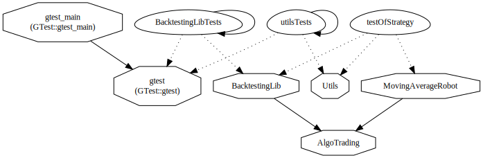
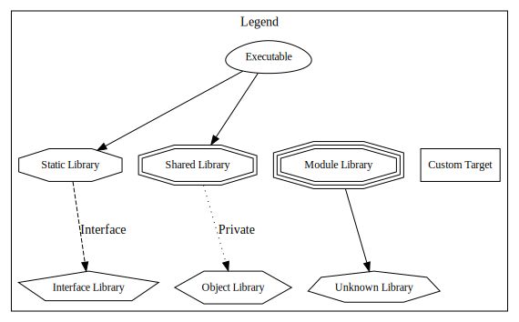

Zpět na [úvod](../../README.md)

## BacktestingLib Specification and Documentation
Knihovna pro backtesting obchodních robotů. Umožňuje testovat vlastní obchodní strategie na reálných historických datech a vliv různých jejich parametrů na výsledný zisk.

Při hledání nejlepších parametrů pro obchodního robota dosahuje, díky využití standardních paralelních C++ algoritmů - [std::transform_reduce](https://en.cppreference.com/w/cpp/algorithm/transform_reduce), dosahuje na stroji s 12 jádry faktoru zrychlení 7. To umožňuje rychleji testovat velké množství kombinací.

Ukázkový výstup demo aplikace:
```
Number of ticks: 858270 parsed in 1525 milliseconds
Simulating of one robot took 13 milliseconds
Simulating of 3920 robots took 6145 milliseconds in parallel and 46706 milliseconds in sequential.
Which means we have achieved 7.60065 speedup factor.
```

Třídu `StrategyOptimizer` lze využít pro implementaci efektivnějších algoritmů pro parametrickou optimalizaci, jako je evoluční algoritmus atd.

## Specification
Vstup: 
- třída obchodního robota, ticky (obchodní data z burzy), parametry simulace (perioda simulace, časový rozsah - od data do data, ...) a případné parametry pro obchodního robota.

Výstup:
- statistiky obchodování jednotlivých instancí robota (zisk, počet obchodů, úspěšnost...).

Běh programu lze rozdělit do 4 fází:
- Inicializace třídy testeru: předání historických tržních dat (csv soubor s předdefinovanou strukturou), předání třídy robota - pravděpodobně pomocí factory metody.
- Nastavení parametrů:
    - Robota
        - Při testování robota většinou chceme vyzkoušet různé kombinace hodnot jednotlivých parametrů (robot může mít libovolné množství parametrů a informace o nich získáme ze třídy robota), uživatel tedy předá rozmezí hodnot a krok, po kterém se vybírají hodnoty z onoho rozmezí.
    - Paralelní simulace
        - Perioda - jak často se volá metoda on_tick() na instanci robota (robot má pro daný moment možnost upravit své obchody) : tick (každá změna ceny - odpovídá realitě), sekunda (možnost zrychlení simulace) atd.
        - Časový rozsah - rozmezí dvou dat; období, které se simuluje.
    - Informace o obchodním účtě: počáteční vklad, finanční páka.
- Paralelní simulace
    - Vytvoření instancí obchodního robota, pro každou kombinaci hodnot parametrů je vytvořena jedna instance. Při vytváření dostává robot přístup k datovému modelu - načítá si z něj data a zadává do něj své obchody.
    - Při simulaci se periodicky volá na instanci robota metoda on_tick() a následně probíhá kontrola zůstatku na účtě robota; při dosažení 0 simulace pro danou instanci končí.
- Výpis obchodních statistik
    - pro každou instanci robota dosažený zisk, počet a úspěšnost obchodů (poměr ziskových/ztrátových).

Externí knihovny by neměly být třeba.

Možná rozšíření knihovny: implementace optimalizačních algoritmů pro velké množství kombinací hodnot jednotlivých parametrů, generování grafů z obchodních statistik, GUI.  


## Documentation

Plnou dokumentaci lze vygenerovat spuštěním [Doxygenu](https://www.doxygen.nl/manual/doxygen_usage.html) v adresáři [project](../), kde je připravený konfigurační [Doxyfile](../Doxyfile). Generování je třeba provést před stažením GTest pomocí CMaku. Doxygen je nakonfigurovaný pro generování diagramů pomocí [Graphviz](https://graphviz.org/).

### Požadavky

Knihovna využívá C++ moduly, přičemž jejich plnou podporu nabízí pouze MSVC. Co se týče Unixu, doporučujeme využít Clang. Podpora překladačů viz [zde](https://en.cppreference.com/w/cpp/compiler_support#C.2B.2B20_features). Mimo vyhovující překladač je nutné mít verzi CMake a Ninja podporující C++ moduly.

### Struktura
Základní strukturu nám představuje graf závislostí `CMake Target`ů níže. Vidíme, že knihovna [AlgoTrading](#algotrading) nemá žádnou závislost. Definuje totiž jen základní struktury, rozhraní a aliasy, které jsou důležité pro komunikaci dalších modulů. Definovaný základ poté využívá [BackterstingLib](#backtestinglib) a [MovingAverageRobot](#movingaveragerobot).

Knihovna `BacktestingLib` poskytuje hlavní esenciální funkcionalitu tohoto projektu. Uživateli je tato funkcionalita k dispozici pomocí tříd `StrategyTester`, který slouží pro testování jednoho nakonfigurovaného robota, a `StrategyOptimizer`, který umožňuje paralelní testování množiny kombinací parametrů obchodní strategie.

Knihovna `MovingAverageRobot` obsahuje implementaci, pro účely ukázky, základní obchodní strategie založené na protínání klouzavých průměrů s různou periodou.
Aby byla tato strategie testovatelná `BacktestingLib`, implementuje implementuje interface `AOS` (z anglického *Automatic Trading System*) definovaný v `AlgoTrading`, jak je vidět na grafu závislostí.

`Utils` poskytuje třídu `CSVParser` sloužící pro parsování CSV souborů, kterou bylo nutné vytvořit, jelikož ve specifikaci nebyla předem zahrnuta knihovna pro práci s CSV.

Moduly ze střední vrstvy finálně integruje spustitelný target [testOfStrategy](#quick-start---demo-aplikace), což je demo aplikace ukazující základní funkcionalitu tohoto projektu. Tato demo aplikace společně s `MovingAverageRobot` představuje uživatelskou část kódu.

Mimo výše zmíněné můžeme vidět na obrázku `BackTestinLibTests` a `utilsTests` využívající `GTest` pro testování příslušných knihoven. Testů však není mnoho.





### Quick start - demo aplikace

Zjednodušená verze obsahu [main metody demo aplikace](../src/TestOfStrategy/testOfStrategy.cpp):

```Cpp
// for loading ticks we need a path to the file containing them in csv format
string path_to_csv_file;
std::getline(std::cin, path_to_csv_file);

// first we need load and parse the ticks
TickParser tick_parser; // custom helper class for parsing the specific csv format.

// load and parse the ticks using tick_parser
Ticks ticks = tick_parser.getTicks(path_to_csv_file);

// check if ticks where parsed successfully
if (ticks.empty()) {
	return -1;
}

// create a strategy tester with the simulation period of 1 second
// and default account properties 
StrategyTester tester(&ticks, SimulationPeriod::S1, AccountProperties());

// create one initalized robot and run it using strategy tester
MovingAverageRobot robot(9, 20, 0.01, 1.6);
TradingResults results = tester.run(robot);

/* ==================================================
** =====Moving to parameter combinations testing=====
*/                                                   

// get combinations of parameters
auto comb = getParameterCombinations();

// initialize the StrategyOptimizer with pointer to configured StrategyTester and robot factory method
StrategyOptimizer<MovingAverageRobot, MovingAverageRobotParameters> optimizer(&tester, createRobot);

// test parameter combinations in parallel
std::pair<TradingResults, MovingAverageRobotParameters> best_pair = return optimizer.findBestParametersParallel(comb);

// sequentially test parameter combinations
best_pair = optimizer.findBestParametersSeq(comb);

// print trading results on demand.
auto [best_results, best_params] = best_pair;
cin.get();
printResults(best_results);

return 0;
```

Můžeme vidět, že aplikace prvně načte data - `ticks` - pomocí vlastního parseru, jelikož se jedná o specifický formát, který má závislosti mezi jednotlivými řádky (viz [TickParser](../src/TestOfStrategy/TickParser.cpp)). Poté spustí pomocí `StrategyTester`u test jedné instance ukázkové obchodní strategie `MovingAverageRobot`. V závěru můžeme vidět konstrukci a použití `StrategyOptimizer`u pro test kombinací parametrů, prvně v paralelní variantě a poté sekvenčně. 

Pro účely demonstrace jsou poskytnuty 2 soubory s obchodními daty v adresáři [/tests/data](../tests/data/). Větší soubor [AUDCAD_202211101500_202211102358.csv](../tests/data/AUDCAD_202211101500_202211102358.csv) vhodný pro běh v release verzi buildu a menší [AUDCAD_202211101500_202211220704.csv](../tests/data/AUDCAD_202211101500_202211220704.csv) pro debugování.

Po spuštění aplikace **je nutné** vložit do konzole absolutní cestu k jednomu z nich.

Pro spuštění v případě Visual Studia stačí v adresáři [src](../src/) spustit příkaz `cmake .` a CMake vytvoří `VS Solution file`, který má jako startup projekt nakonfigurovanou demo aplikaci.

### AlgoTrading

Knihovna `AlgoTrading` definuje základní struktury, rozhraní a aliasy. Krom toho má zadefinované trvání `TimeFrames`. Viz `timeframe_durations`:

```cpp
/**
 * @brief Represents various timeframes for market data.
 */
enum class Timeframe {
	MIN1,
	MIN5,
	MIN15,
	MIN30,
	H1,
	H4,
	D1,
	W1,
};

/**
 * @brief Durations for the respective timeframes.
 */
constexpr std::chrono::milliseconds timeframe_durations[]{
	1min,
	5min,
	15min,
	30min,
	1h,
	4h,
	24h,
	168h
};
```

#### Struktury

Z definovaných struktur jsou významné `Tick`, `Bar`, `Order`, `Position` a `Trade`.
Jedná se o standardní elementy algoritmického obchodování. Viz soubory [MarketData.ixx](../src/AlgoTrading/MarketData.ixx) a [BrokerConnection.ixx](../src/AlgoTrading/BrokerConnection.ixx).

#### Aliasy

Pro reprezentaci seznamu definovaných struktur jsou použity různé kontejnery. Pro jednoduchost jsme jim přiřadili aliasy: `Ticks`, `Bars`, `Orders`, `Position::List` a `Trades`.

#### Rozhraní

Implementace obchodních strategii musí být odvozené od abstraktní třídy:

```cpp
// Represents a Interface for an automatic trading system.
export class ATS {
public:
    // Default constructor.
	virtual ~ATS() = default;

	// Called when the ATS is started.
	virtual int onTick(const Tick&) = 0;

    // Called when the ATS is being started.
	virtual ReturnCode start(BrokerConnection* brokerConnection) { 
		return ReturnCode::OK;
	}

    // called when a margin level of the account reaches margin warning level.
	virtual void onMarginCallWarning() {}

	// Called when the ATS is being stopped.
	virtual void end() = 0;
};
```

Aby mohl implementovaný robot dle zamýšlené strategie obchodovat potřebuje spojení s brokerem -  Interface `BrokerConnection`, kterému předává objednávky - `Order` a přes kterého spravuje své obchodní pozice a má přístup k obchodním datům. Robot dostává pointer na tento objekt při volání metody `start(BrokerConnection* brokerConnection)`.

### BacktestingLib

`BacktestingLib`, gró projektu, zajišťuje backtesting strategii a testování kombinací jejich parametrů.
Třída `StrategyTester` má za úkol simulovat obchodování předaného robota. Při konstrukci dostává surová obchodní data ve formě `Ticks`, žádanou periodu simulace (zda má metodu robota `onTick` volat na každou změnu ceny, či v delších časových intervalech) a strukturu `AccountProperties`, která obsahuje informace o vlastnostech simulovaného obchodního účtu, tím je např. počáteční zůstatek.

Pro samotnou simulaci používá 3 pomocné třídy: `TradingManager`, `MarketDataManager`, `SimulatedBrokerConnection`. `TradingManager` obstarává správu obchodování - zpracování objednávky, uzavření pozice, kontrolu stavu účtu atd.  `MarketDataManager` obstarává obchodní data ve formátu svíček (`Bars`), jednotlivé druhy svíček předpočítává on demand až v čase, kdy jsou potřeba, a to navíc v thread-safe formě, tak aby jedna instance `MarketDataManager` mohla být používána paralelně. `SimulatedBrokerConnection` je implementací rozhraní `BrokerConnection` a využívá instance `TradingManager` a `MarketDataManager` pro zajištění své funkcionality.

`MarketDataManager` deleguje své povinnosti mezi 2 pomocné třídy: `AccountBalanceManager` a `PriceEventManager`. `AccountBalanceManager` spravuje zůstatek účtu a s tím spojené události, jako je margin call při poklesu pod určitou hodnotu. `PriceEventManager` hlídá zda nějaká pozice (neuzavřený obchod) nedosáhla definované ceny - stop loss/take profit (cena, při které se pozice uzavírá pro omezení ztrát, respektive zabezpečení výdělku). Pro hlídání nejbližší definované ceny, při které má nastat nějaká událost `PriceEventManager` používá `PositionIteratorQueue`, což je dynamická prioritní fronta.

`StrategyTester` tedy jen řídí plynutí času (na kterém jsme ticku) a orchestraci pomocných tříd. Po projití všech dat (ticků), vrací strukturu `TradingResults`:

```cpp
struct Results {
    double account_balance;
    double total_equity;
    Position::List unclosed_positions;
    Trades trades;
};
```

Tuto strukturu `StrategyTester` získává od instance `TradingManager` příslušící danému robotovi.

Třída `StrategyOptimizer` využívá `StrategyTester` pro testování jednotlivých kombinací parametrů.
Pro testování paralelním způsobem používá [std::transform_reduce](https://en.cppreference.com/w/cpp/algorithm/transform_reduce), kdy transform fáze z dané kombinace parametrů vytvoří instanci robota a nechá `StrategyTester` vygenerovat výsledky obchodování, reduce fáze vybírá nejvyšší zůstatek a vrací dvojici výsledků obchodování a příslušných parametrů.

### MovingAverageRobot

`MovingAverageRobot` reprezentuje obchodní strategii založenou na protínání klouzavých průměrů s různou periodou a má 4 parametry: perioda krátkého klouzavého průměru, perioda dlouhého, dovolený risk na jeden obchod a poměr zisku a odměny při otevírání obchodu. Po signálu protnutí najde minimum/maximum ceny v posledních několika svíčkách. Počet závisí na periodě rychlejšího klouzavého průměru a minimum hledáme v případě, že otevíráme dlouhou pozici (vyděláváme na vzrůstu) a maximum v případě krátké pozice (vyděláváme na poklesu ceny podkladového aktiva). Na maximum/minimum umístí stop loss a na součet aktuální ceny a násobek rozdílu aktuální ceny a maxima/minima umístí take profit. 

### Utils

Knihovna `Utils` obsahuje pouze třídu `CSVParser`, která je pomocnou třídou pro načítaní a parsování CSV souborů.

## Závěr

S jedním drobným rozdílem se nám podařilo vytvořit knihovnu a příslušnou demo aplikaci poskytující funkcionalitu popsanou ve [specifikaci](#specification). Drobným rozdílem je absence možnosti nastavit rozsahy hodnot parametrů obchodní strategie a automaticky tak generovat jejich kombinace. Přestože byla vyzkoušena řada přístupů, nebyl objeven žádný schůdný. Jako alternativní řešení bylo zvoleno předání vektoru struktur reprezentujících kombinace parametrů robota. Tento vektor musí vytvořit uživatelská část a předat jej třídě `StrategyOptimizer`.

Ač při implementaci bylo naraženo na limity standardu C++ 20 a jeho podpory a musela být překonána řada překážek, příkladem je absence podpory C++ modulů IntelliSense, autor si vývoj užil a při tom si rozšířil povědomí o C++. 